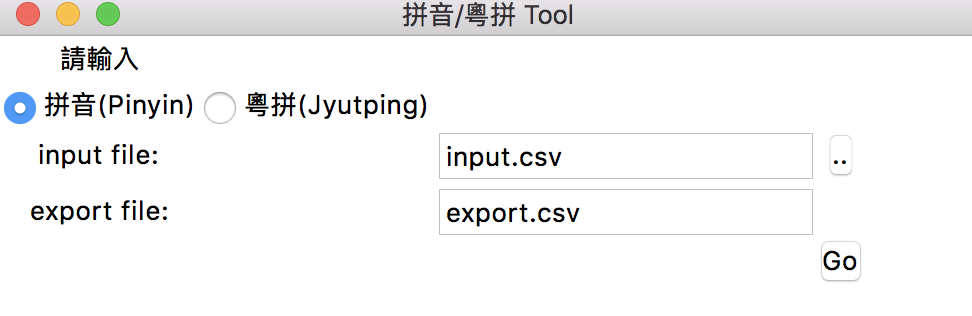

PinYinGUI Jyutping(拼音/粵拼) 
==
這是一個結合Pypinyin與Jyutping專案的中文拼音與粵語拼音的工具
並以tkinter打包

使用方式：
--
step1:
```
pip install pandas
```
```
pip install pypinyin
```
step2:
```
python main.py
```


GUI開啟後選擇檔案(input.csv)即可執行，範例如下

Input example
--
#### input.csv
```
chinese
市立文林國小(台北市)
市立義方國小(台北市)
市立立農國小
市立明德國小
市立洲美國小
```


PinYin Database:
--
https://github.com/mozillazg/python-pinyin
- single mode: pinyin-data  https://github.com/mozillazg/pinyin-data
- phrase mode: phrase-pinyin-data https://github.com/mozillazg/phrase-pinyin-data
- self-defined


Jyutping Database
--
https://github.com/imdreamrunner/python-jyutping
- 2013年 kaifangcidian.com   http://www.kaifangcidian.com


Release Note:
--
| Date | Model | Version | Note|
| :-------- | :----- | :---------- | :---------- |
| 2018-07-02   | PinYin Jyutping Tool | 0.2 | revise output bug 'Café'(encode error)|
| 2018-06-29   | PinYin Jyutping Tool | 0.1 | Beta|
